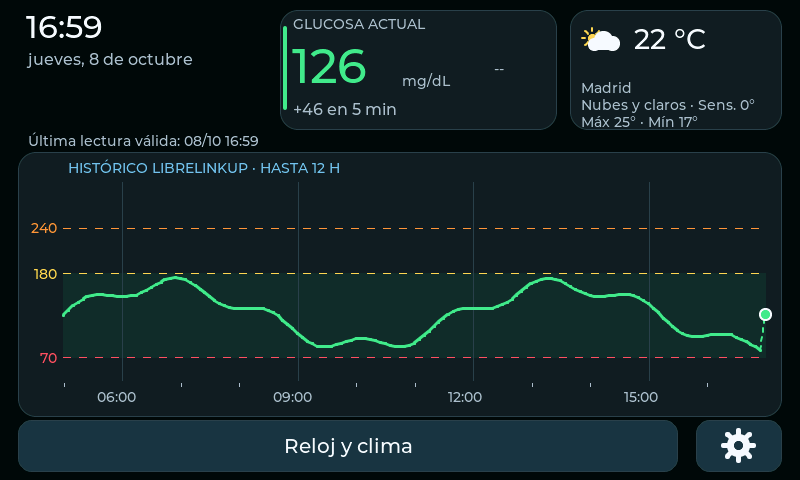

# Gluco Waveshare 2.0.0

Monitor en C++ para **Waveshare ESP32-S3-Touch-LCD-4.3B y 4.3B-BOX**: pantalla RGB 800×480, ST7262, táctil GT911, expansor CH422G, flash de 16 MB y PSRAM OPI de 8 MB. Usa el perfil oficial de la placa de ESP32_Display_Panel. No grabar estos binarios en el modelo 4.3 sin B ni en pantallas de otras medidas.

Revisión del proyecto [RSanchez996/gluco_waveshare](https://github.com/RSanchez996/gluco_waveshare), tomando como base el commit `8f66481796cffacfc3bd8f94aa7a576ceae8dc33`. Mantiene LibreLinkUp, usuarios, histórico de 12 horas, reloj, clima, ajustes táctiles, redes guardadas, portal QR y apagado de la iluminación por toque. La gráfica crece de 201 a **265 px** de alto; el área útil de trazado crece de 134 a **198 px**.



## Instalar los binarios incluidos

No necesitas compilar ni instalar Arduino IDE/PlatformIO. Necesitas Python 3.10 o posterior, conexión a Internet para instalar esptool la primera vez y un cable USB de datos. Extrae el ZIP entero en una carpeta de tu ordenador. Cierra cualquier monitor serie que esté usando la placa.

1. Conecta el conector USB de programación. Identifica su puerto: por ejemplo `COM5` en Windows, `/dev/ttyACM0` en Linux o `/dev/cu.usbmodem...` en macOS.
2. Abre una terminal en la carpeta extraída y ejecuta:

   **Windows:**

   ```bat
   instalar.bat COM5
   ```

   **Linux/macOS:**

   ```bash
   bash instalar.sh /dev/ttyACM0
   ```

   Sustituye el puerto por el tuyo. Los scripts crean su entorno Python e instalan `esptool==4.12.0`.
3. El instalador verifica SHA-256, chip/capacidad de flash y tabla de particiones. **Antes de escribir**, guarda una copia de NVS, tabla de particiones y estado OTA en `nvs_backups/FECHA/`. Si la tabla coincide con el proyecto original, conserva tus ajustes y claves. Las copias contienen credenciales: guárdalas en privado.
4. La placa se reinicia. Si conservaba una configuración válida, la utiliza; si está vacía, abre Ajustes. Configura primero Wi-Fi de **2,4 GHz**, luego cuenta LibreLinkUp y usuario. Clima es opcional. La primera consulta espera conexión estable y hora NTP para validar los certificados.

Si no entra en programación, mantén **BOOT**, pulsa y suelta **RESET**, suelta BOOT y repite. Si falla la transmisión, añade `--baud 115200`. En Linux el usuario necesita acceso al puerto serie; en Debian/Ubuntu normalmente se concede mediante el grupo `dialout` y un nuevo inicio de sesión.

Si aparece «Particiones incompatibles», el instalador se detiene sin escribir. Esto puede ocurrir con el firmware de fábrica o una versión antigua con otra distribución. Para una instalación desde cero, después de conservar el respaldo, ejecuta explícitamente:

```bash
bash instalar.sh /dev/ttyACM0 --instalacion-limpia
```

En Windows: `instalar.bat COM5 --instalacion-limpia`. **Esta opción borra toda la flash y tendrás que introducir de nuevo los ajustes.** No la uses para una actualización normal.

La actualización normal escribe únicamente bootloader, tabla de particiones, estado OTA inicial y aplicación. Inicializa el estado OTA para arrancar la aplicación nueva en `app0`; no escribe la partición NVS ni SPIFFS. No incluye actualización OTA por red.

## Cambios que atacan el desplazamiento y el watchdog

El fallo observado es compatible con falta de servicio del RGB/DMA, escritura sobre el framebuffer en uso y contención de PSRAM. La revisión del código identifica condiciones que favorecían esos problemas; sin una placa conectada no se puede atribuir cada desplazamiento a una causa única.

- **Core 1:** inicialización RGB, interrupciones de sus bounce buffers, LVGL, táctil e iluminación. Ninguna consulta HTTPS ni servidor web bloqueante se ejecuta en la GUI.
- **Core 0:** un trabajador posee consultas, cambios de Wi-Fi y guardado NVS. El servidor HTTP nativo recibe formularios en otra tarea del core 0 y encola el trabajo. No manipula LVGL ni realiza consultas al proveedor. Colas acotadas y respuestas de estado evitan lanzar varias operaciones a la vez.
- **Pantalla:** dos framebuffers en PSRAM, dos bounce buffers internos de 20 líneas y un buffer LVGL de 12 líneas en SRAM. El intercambio espera la notificación `on_frame_buf_complete` del driver IDF antes de escribir sobre el framebuffer liberado; solo replica los tramos modificados. Reloj de píxel de 12 MHz, como en la configuración anterior. El driver detecta EOF incompletos y recupera la transmisión en VSYNC; la app no reinicia el RGB tras cada consulta.
- **Caché:** SDK compilado desde fuentes con `CONFIG_SPIRAM_XIP_FROM_PSRAM=y`, caché de datos de 64 KB/líneas de 64 bytes e ISR RGB en IRAM. Esta configuración evita que una escritura NVS desactive el acceso de caché que necesita el modo bounce.
- **Memoria:** reserva interna de 128 KiB para necesidades de DMA/pilas, TLS y caché NVS en PSRAM y buffers Wi-Fi acotados. El cuerpo HTTP usa un único buffer PSRAM reutilizable de hasta 512 KiB; los documentos JSON filtrados también usan PSRAM. Wi-Fi sacrifica optimizaciones de IRAM para dejar más memoria interna disponible.
- **Watchdog:** siguen vigilados los dos idle y la tarea GUI, con timeout de 8 s. El trabajador de datos tiene prioridad 0 y cede CPU durante lecturas y análisis JSON. No se desactiva el watchdog para ocultar bloqueos. Una solicitud HTTPS tiene presupuesto cooperativo de 30 s con timeouts de transporte y lectura; las esperas bloquean la tarea de red, no la GUI.
- **Estado:** las tareas usan copias propias de ajustes bajo mutex y snapshots de datos. Al cambiar de paciente se borra en RAM la lectura anterior antes de publicar la nueva. Las claves no se devuelven al navegador ni se imprimen en los diagnósticos.

Consulta `docs/REVISION.md` para configuración exacta, fuentes, pruebas y límites.

## Compilar y modificar

Se usa **ESP-IDF v5.5.5** con Arduino-ESP32 **3.3.12 como componente**, compilado desde fuentes. Las bibliotecas de aplicación están incluidas y fijadas en `firmware/components`. Este proyecto sustituye la ruta antigua de PlatformIO: cambiar macros en un SDK Arduino precompilado no recompila las opciones XIP del driver.

Instala el SDK oficial siguiendo [la guía de Espressif](https://docs.espressif.com/projects/esp-idf/en/v5.5.5/esp32s3/get-started/index.html), seleccionando la versión v5.5.5 y el target esp32s3. Ejemplo Linux/macOS:

```bash
git clone --branch v5.5.5 --recursive https://github.com/espressif/esp-idf.git ~/esp-idf-gluco
cd ~/esp-idf-gluco
./install.sh esp32s3
source ./export.sh
cd /ruta/gluco_waveshare_v2.0.0
bash compilar.sh
```

El script regenera los assets web, ejecuta las pruebas y compila; después actualiza `bin/` y su manifiesto SHA-256. Para las pruebas de host necesitas también `g++`, Node.js y Python 3. El SDK necesita sus herramientas estándar. En Windows utiliza la terminal ESP-IDF activada:

```bat
set IDF_COMPONENT_MANAGER=0
python tools\embed_web.py
python tools\test_all.py
python "%IDF_PATH%\tools\idf.py" -C firmware build
python tools\export_bin.py
```

`firmware/sdkconfig.defaults` es la configuración mantenida. Se entrega también el `sdkconfig` usado para los binarios. Después de modificar opciones del SDK, ejecuta `idf.py -C firmware reconfigure build` con `IDF_COMPONENT_MANAGER=0`. Los guardas de compilación rechazan una build sin XIP, sin caché de 64 bytes o sin ISR RGB en IRAM.

## Diagnóstico y comprobación en tu placa

En Linux/macOS, tras instalar: `bash monitor.sh /dev/ttyACM0`. En Windows: `.tools\flash-venv\Scripts\python.exe -m serial.tools.miniterm COM5 115200`. Sal del monitor con Ctrl+]. La consola imprime `[DISPLAY]`, `[HTTPS]` y `[HEALTH]`. En `[HEALTH]`, los márgenes de pilas son **bytes**, como en FreeRTOS de ESP-IDF. El portal abierto expone también `/api/diagnostics`.

Prueba 24–48 horas con la placa: consultas normales, abrir/cerrar QR durante consultas, cambiar usuario, guardar Wi-Fi/ubicación, desconectar el router, recuperar la conexión, dormir/despertar la pantalla y reiniciar para comprobar persistencia. Comprueba que no hay desplazamientos ni watchdog y que memoria libre, mayor bloque interno y margen de pilas se estabilizan. `docs/REVISION.md` incluye criterios concretos.

**Validado aquí:** compilación y enlace Xtensa ESP32-S3, verificaciones del SDK, pruebas del procesamiento de histórico/fechas/unidades y del proveedor con respuestas simuladas, sanitizadores ASan/UBSan, 10 pruebas del instalador y render de la UI con LVGL en host. **Pendiente en hardware:** arranque, estabilidad prolongada de RGB/DMA, márgenes de memoria durante TLS y acceso real a tu cuenta. No se ha conectado físicamente tu placa ni se han usado tus credenciales. LibreLinkUp emplea una API privada que puede cambiar.

## Archivos

- `bin/`: imágenes listas para grabar, hashes y ELF con símbolos para diagnóstico.
- `firmware/`: aplicación C++, configuración y dependencias fijadas.
- `tools/`: compilación, instalación, tests y assets.
- `web/`: portal de configuración.
- `tests/`: pruebas de host y render de interfaz.
- `docs/`: revisión técnica y vistas con datos de ejemplo.

Licencia del proyecto original y código de aplicación: MIT, conservando su atribución. Las dependencias tienen sus propias licencias; consulta `THIRD_PARTY_NOTICES.md`.
